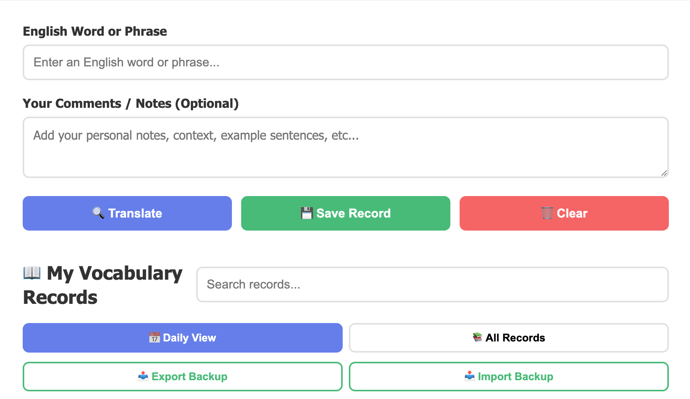
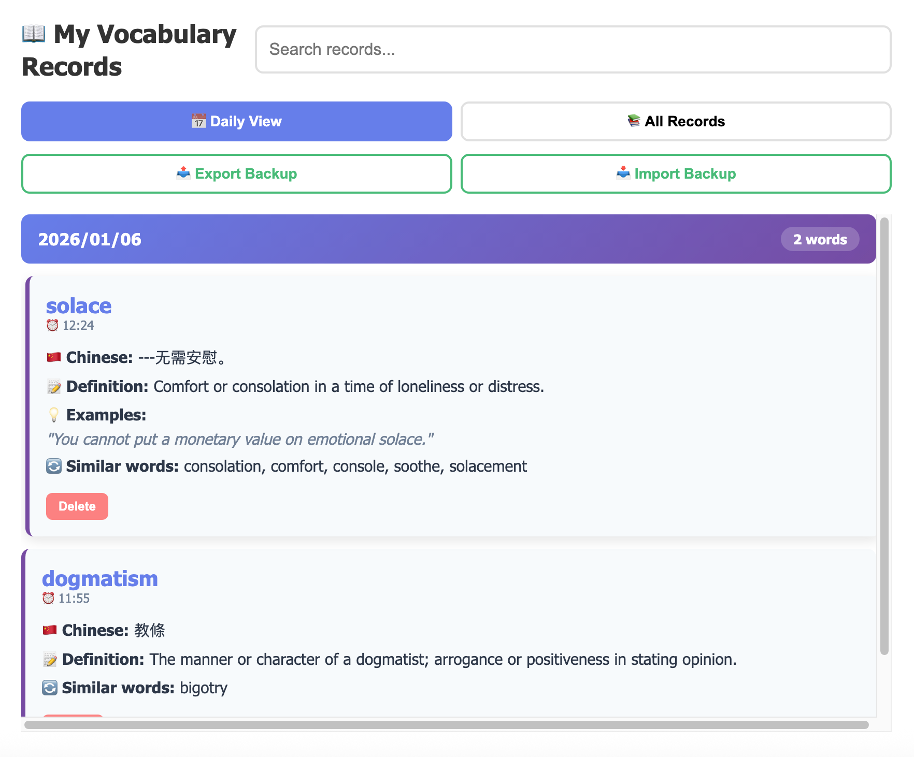

# 📚 English-Chinese Dictionary Tool

> A powerful vocabulary learning tool with timestamp recording and cloud synchronization

[中文说明](#中文说明) | [Live Demo](#) | [Getting Started](#getting-started)

---

## ✨ Overview

An intelligent English-Chinese dictionary designed for serious language learners. Unlike traditional translation tools, this application helps you **track your learning journey** by recording when and what you search, enabling you to review your vocabulary progress over time.

Perfect for students, professionals, and anyone reading English books or articles who wants to build their vocabulary systematically.

## 🎯 Key Features

### Core Translation Features
- 🇨🇳 **Chinese Translation** - Instant translation to Simplified Chinese
- 📝 **English Definitions** - Clear explanations with part of speech
- 💡 **Example Sentences** - Real-world usage examples
- 🔄 **Synonyms & Similar Words** - Expand your vocabulary
- ✨ **Word Replacement Guide** - Learn to replace common words with advanced alternatives
- 💭 **Personal Notes** - Add your own context and observations

### Learning Management
- ⏰ **Timestamped Records** - Every search is saved with date and time
- 📅 **Daily View** - Review what you learned each day
- 🔍 **Smart Search** - Find words in your history instantly
- 📊 **Progress Tracking** - See your vocabulary growth over time

### Sync & Backup
- ☁️ **Cloud Synchronization** - Access your vocabulary from any device
- 🔐 **User ID System** - Secure personal data storage
- 📤 **Export/Import** - Backup your records as JSON files
- 📱 **Multi-device Support** - Seamless experience across phone, tablet, and computer

### Smart Features
- 🎯 **Auto-suggestions** - Word recommendations as you type
- 🌐 **Works Offline** - Add words offline, sync when connected
- 💾 **Auto-save** - Records synced to cloud automatically
- 🎨 **Clean Interface** - Distraction-free learning experience

## 🚀 Getting Started

### Option 1: Use the Hosted Version (Recommended)

1. Visit the live demo: [Your GitHub Pages URL]
2. Create a User ID (e.g., `john_vocab_2025`)
3. Start searching and saving words!
4. Use the same User ID on all your devices to sync

### Option 2: Self-Host with Cloud Sync

1. **Clone the repository**
   ```bash
   git clone https://github.com/yourusername/dictionary-tool.git
   cd dictionary-tool
   ```

2. **Set up Firebase** (for cloud sync)
   - Follow the [Firebase Setup Guide](FIREBASE_SETUP_GUIDE.md)
   - Update `firebaseConfig` in `index.html` with your credentials

3. **Deploy**
   - Upload to GitHub Pages, Netlify, or any static hosting
   - Or simply open `index.html` locally in your browser

### Option 3: Standalone (No Cloud Sync)

Download `dictionary_tool.html` and open it in any browser. Use Export/Import for manual syncing between devices.

## 📖 How to Use

### Basic Workflow

1. **Search a word** - Type any English word
2. **Review translation** - See Chinese translation, definition, examples, and synonyms
3. **Add notes** - Include context from your reading
4. **Save** - Record is automatically timestamped and synced
5. **Review** - Browse by date to reinforce learning

### Tips for Best Results

- 📝 **Add context in notes** - Include the sentence or book you found the word in
- 🔄 **Click similar words** - Explore related vocabulary
- 📅 **Review daily** - Use Daily View to revisit words you learned
- 💾 **Export regularly** - Keep backups of your vocabulary progress
- 🎯 **Use consistent User ID** - Same ID on all devices ensures perfect sync

## 🛠️ Technology Stack

- **Frontend**: Pure HTML/CSS/JavaScript (no frameworks)
- **Translation API**: MyMemory Translation API
- **Dictionary API**: Free Dictionary API
- **Synonyms**: Datamuse API
- **Cloud Database**: Firebase Realtime Database
- **Hosting**: GitHub Pages (or any static host)

## 📱 Browser Compatibility

- ✅ Chrome/Edge (Desktop & Mobile)
- ✅ Safari (Desktop & Mobile)
- ✅ Firefox (Desktop & Mobile)
- ✅ Opera

## 🔒 Privacy & Security

- Your vocabulary data is stored in your personal Firebase database
- User IDs are self-created - choose something unique
- No personal information is collected
- All data is encrypted in transit (HTTPS)
- You can export and delete your data anytime

## 📸 Screenshots

### Desktop View


### Mobile View


### Daily Records View


## 🤝 Contributing

Contributions are welcome! Feel free to:

- 🐛 Report bugs
- 💡 Suggest new features
- 🔧 Submit pull requests
- 📖 Improve documentation

## 📄 License

MIT License - feel free to use this project for personal or commercial purposes.

## 🙏 Acknowledgments

- Translation powered by [MyMemory API](https://mymemory.translated.net/)
- Dictionary data from [Free Dictionary API](https://dictionaryapi.dev/)
- Synonyms from [Datamuse API](https://www.datamuse.com/api/)

## 📞 Support

Having issues? Please [open an issue](https://github.com/yourusername/dictionary-tool/issues) or contact [your email].

---

## 中文说明

### 📚 关于本项目

这是一款专为英语学习者设计的智能词典工具，与市面上的普通翻译软件不同，本工具的最大特色是**记录学习轨迹**。

### 🎯 核心功能

**翻译功能**
- 🇨🇳 中文翻译
- 📝 英文释义（含词性）
- 💡 例句展示
- 🔄 近义词推荐
- ✨ 词汇替换指导
- 💭 个人批注

**学习管理**
- ⏰ 时间戳记录 - 每次搜索都会记录日期和时间
- 📅 按日期查看 - 回顾每天学习的单词
- 🔍 智能搜索 - 快速查找历史记录
- 📊 学习进度追踪

**同步与备份**
- ☁️ 云端同步 - 多设备无缝访问
- 🔐 用户ID系统 - 个人数据安全存储
- 📤 导入导出 - JSON格式备份
- 📱 多设备支持 - 手机、平板、电脑完美适配

### 🚀 快速开始

1. 访问在线版本：[您的网站链接](https://jerrychow0505.github.io/dictionary-tool/)
2. 创建用户ID（例如：`zhang_vocab_2025`）
3. 开始搜索和保存单词
4. 在所有设备上使用相同的用户ID即可同步

### 💡 使用建议

- 在笔记中添加单词的上下文
- 点击近义词探索相关词汇
- 定期使用"每日视图"复习
- 定期导出备份
- 所有设备使用相同的用户ID

### 📞 联系方式

遇到问题？请在[GitHub Issues](https://github.com/yourusername/dictionary-tool/issues)提交反馈。

---

<div align="center">

**[⭐ Star this project](https://github.com/yourusername/dictionary-tool)** if you find it helpful!

Made with ❤️ for language learners

</div>
